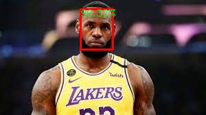
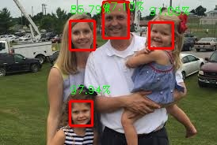
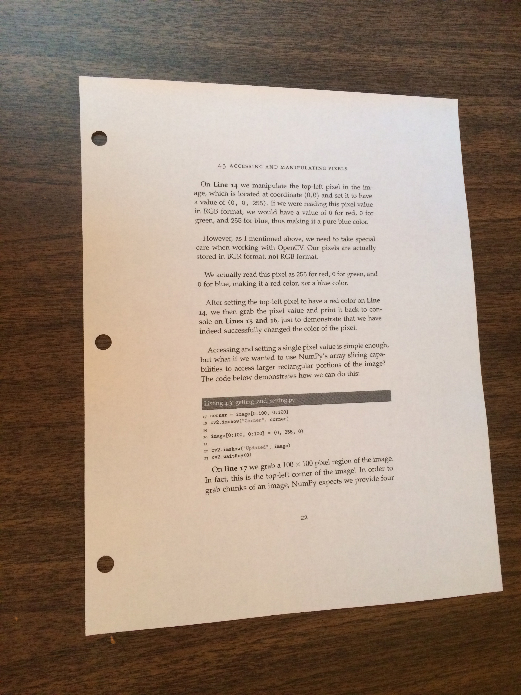
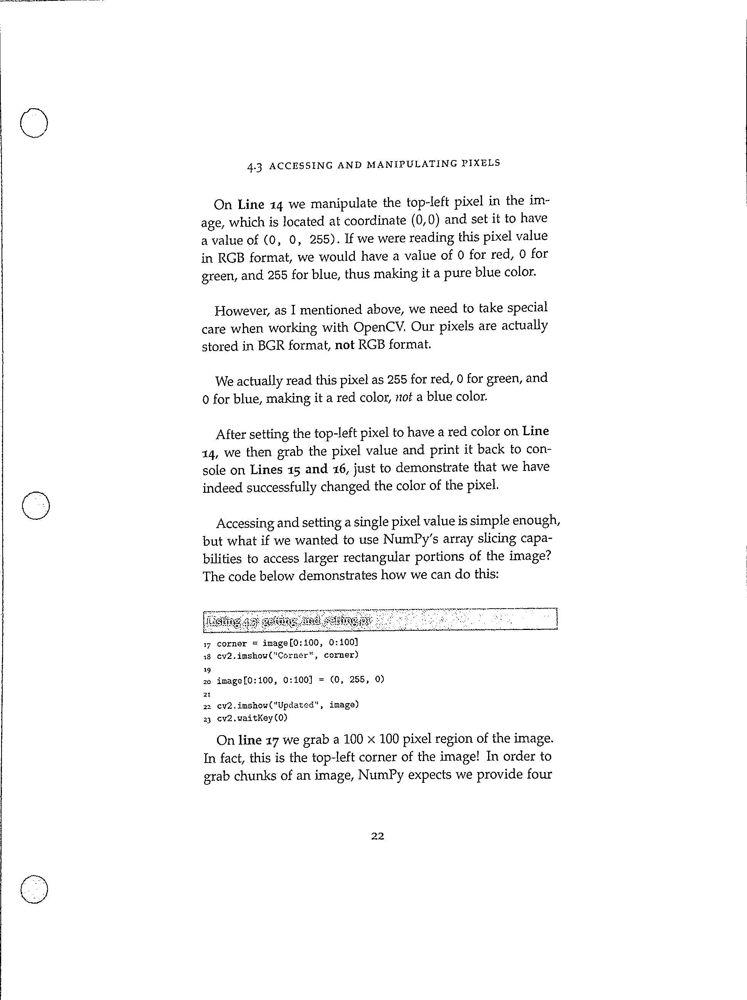

# OpenCV-Applications
Simple applications which have been built using OpenCv

## 1.Face Detection
It does not use the Haar Cascade Classifier. Instead it uses the latest dnn module. It detects the faces in an image more accurately as compared to Haar Cascade. It includes the code for photos as well as videos.

For example after applying it on below image

The output is:

Trying it on another image with 3 or 4 people:

## 2. Document Scanner
As the name suggests it scans the document like bill or any page. The transformer.py has been taken from pyimagesearch which basically transforms the image to give head on view of the image. It uses techniques like canny edge detection, contour detection etc. In order to reduce the number of contours detected we assume that the page will be the contour of four sides and largest area.

Output:

## 3. Color Identification
It is used to identify different colors in an image. It makes use of OpenCV and KMeans Algorithm. Please refer to the notebook for code and examples.

Rithik Jain
